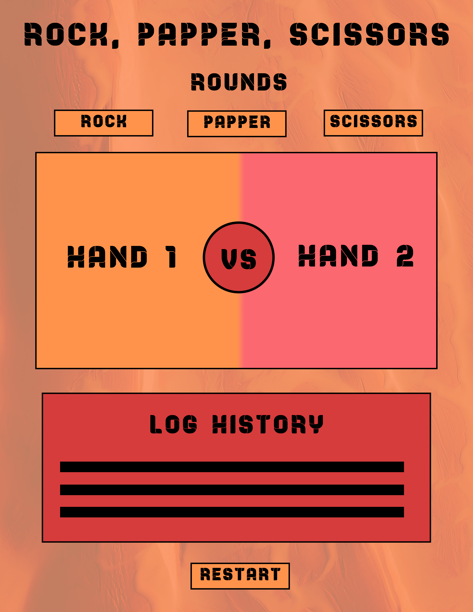

                    {{ROCK PAPER SCISSORS GAME!!!!}}
 
                        {{GAME IDEAS}}

Buttons: the user will be able to hover over the button options
 and see the shape displayed

when the player is not hovering over any option the shape will go into a neutral shape(rock)

once the player makes a choice the game will start.

ROUNDS: The best of 3 rounds wins the game

add a settimeoout to the log results
add a settimeout to the user and cpu results.

RESTART: once the game is finished it will be restarted automatically
before the game restarts there will be a timer of 5seconds 

LOG HISTORY: this will display the History of the different rounds

                     {{FUTURE IMPLEMNTATIONS}}

ENVIRONMENT: I would like to have different buttons on the
right side of the website that will allow the user to choose a
different background (maybe add a button that will allow the user to choose a random BG) 

MUSIC PLAYER: add a music player to reproduce while the game is happening.

PLAYER2: add a second user player in the future.

ANIMATIONS: while the game is starting there will be a  'shake' animation

